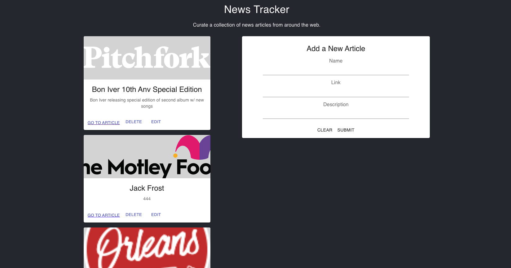
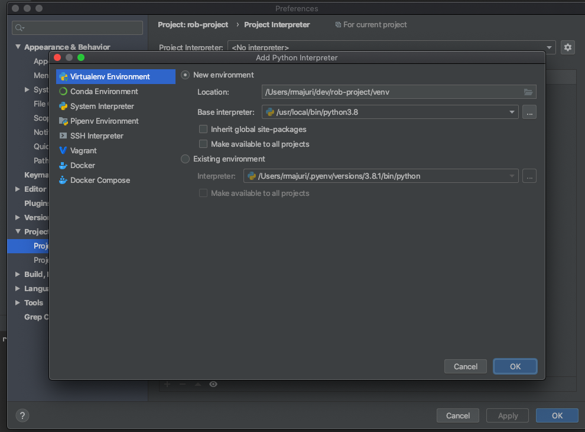

# Rob Majuri - Newstracker Project

This is a simple backend/frontend project that lets you GET, POST, UPDATE, and DELETE news articles that you curate from around the web.

One "article" consists of the following:

* `name`: (str) Name that you give the article you save
* `link`: (url) Link to the article
* `description`: (str) Reason why you save the article
* `image`: (url) Path to the image associated with the article (fetched by the server upon a POST request). Empty if no image is found.

### Running this project
1. Clone this repository
2. Set the Python interpreter for this project as follows:

3. run `source venv/bin/activate`
4. run `pip install -r requirements.txt`
5. Run `python manage.py runserver`

This will serve the React frontend project (found in the `frontend/build` folder) at `http://127.0.0.1:8000/`.

APIs can be located at `http://127.0.0.1:8000/api/articles/`.

Models are editable at `http://127.0.0.1:8000/admin/`.

Django admin credentials for this project: `robmajuri / govexec12345`.

### Technologies used

### Frontend
The frontend uses React JS, with an adherence to ES6 conventions. I used this because of my familiarity with it, along with the libraries [Material UI](https://material-ui.com/) for easy styling and [Formik](https://formik.org/) for easy form control and validation.

Additionally, I used React to demonstrate that I could be of help to a team using this framework.
 
### Backend

As prescribed, the backend uses Django Rest Framework for CRUD operations. It also harnesses the Python library [Beautiful Soup](https://www.crummy.com/software/BeautifulSoup/bs4/doc/) for extracting images from third party URLs.

### Improvements

With more time, I think that the project could benefit from improved logging, comments, and error handling. Additionally, UI/UX changes such as loading states while fetching could improve the user experience.

While the frontend validates URL input for the `link` attribute, the backend currently does not.

The project itself could use some gardening. It may still contain some unnecessary files and code that come for free with bootstrapping a Django project. It needs a `.gitignore` file.

### Things learned

This was my first project using Django. I appreciated the heavy lifting that Django offers for API models, serialization and validation. It's clear why Django's value offer is "rapid development". I plan to use the library for server-side projects in the future.

It also wasn't clear to me when I set out using React for this project how I was going to serve my frontend assets from Django. It was a fun challenge to figure out how to do that.

### Summary
I'm thankful for the learning opportunities that this project offered. 

### Extra 

The front end code can be found [here](https://github.com/rmajuri/rob-project-fe).
